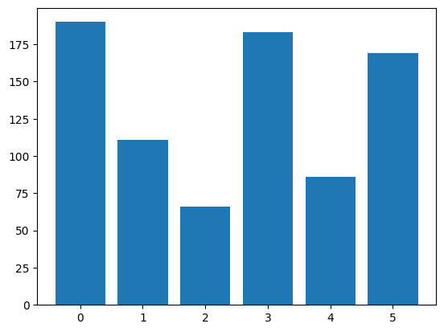
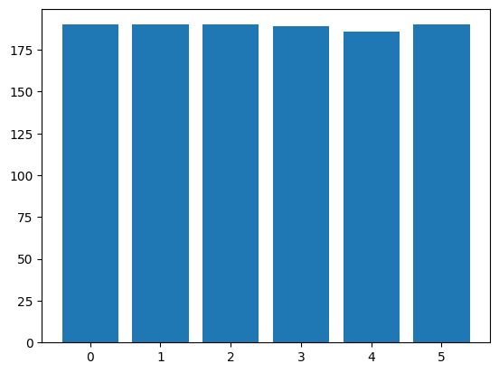
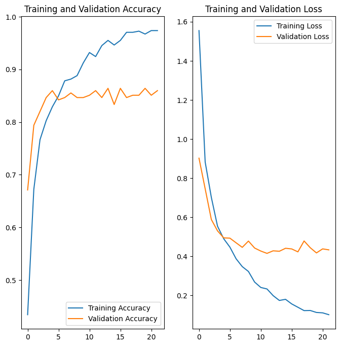

# solar_pannel_image_classification
This repo contains developing a classification model which can be used to classify drone images of the solarpannels which would classify them into the following classes

1. Dusty
2. Snow-Covered
3. Physical-Damage
4. Clean
5. Electrical-damage
6. Bird-drop 

## Dataset Used
The dataset used to train the model can be downloaded from the [link](https://drive.google.com/file/d/1wBGp6ntKB9D0NpYs0Zg70PlK9I9dDFWH/view?usp=drive_link)

The dataset contains the folders for each class with the image samples

1. Dusty - 190
2. Snow-Covered - 111
3. Physical-Damage - 66
4. Clean - 183
5. Electrical-damage - 86
6. Bird-drop - 169


## Dataset balancing
Here the dataset is imbalanced where the `number of samples` in all the classes are `not same`. The model trained in this dataset will be biased where the class which has higher number of sample `[Dusty]` will have better performance compared to other classes.



### Data Augmentation
To balance the samples in the dataset we do the process of augmentation where we do simple transformations like fliping, rotation etc to the existing sample and make them as new samples which results in the increased samples.

Here in this the data augmentation is done with the `ImageDataGenerator` from `tensorflow.keras.preprocessing.image` with the following parameters
```bash
rotation_range=20,
horizontal_flip=True,
vertical_flip=True,
brightness_range=[0.7, 1.3],
zoom_range=0.1,
width_shift_range=0.1,
height_shift_range=0.1,
fill_mode='nearest'
```


## Training
The training is done using taking a pretrained model here used is `DenseNet` which is trained on Imagenet dataset. Which is taken and added layers on top of it, to use the feature map generated by the pretrained model to classify for this usecase.



The model gave the accuracy of **86%** during training which is good for the small dataset like this.

To use the ipynb make sure you download the dataset and put it in your drive of colab.
